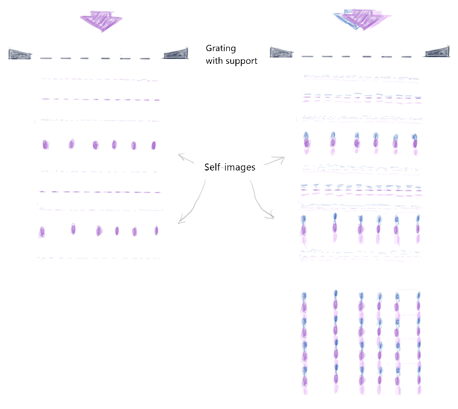
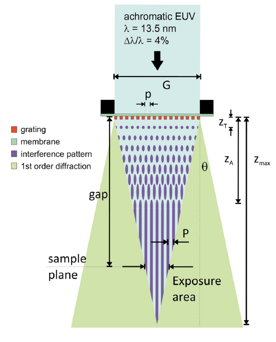
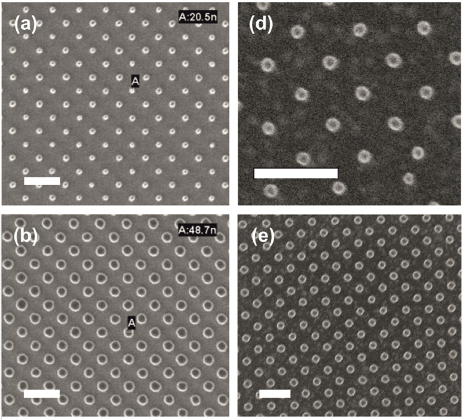

### Concept

Talbot observed in 1836 that monochromatic light passing through a diffraction grating produced repeated images of the grating at integer multiples of the Talbot distance $$z_{T}$$. For broadband light, the Talbot distance for each wavelength is different, so at some distance (let's call it the achromatic Talbot distance $$z_{A}$$) all the grating self-images corresponding to the different wavelengths merge and blur together to form a propagating grating image that is z-invariant. As the distance from the grating increases further, the diffraction orders stop overlapping (since they are propagating at an angle), and eventually only the 0th-order is left.

*Fig. 1: Left - Talbot effect is the self-image of a diffraction grating under monochromatic light. Right - for achromatic light all the self-images blur together to form a z-invariant self-image.*

This means at the intermediate distance where the self-images are blurred together but not so far that interference stops, the aerial image is a z-invariant periodic pattern which can be used to pattern photoresist. Because of the z-invariance, it is robust to tilt and positioning, while having a patternable area as large as the diffraction grating, with no 'dead' space. Since most of the diffraction orders participate in interference, the light transmission is high and therefore patterning is very efficiency.

### Calculations

For monochromatic coherent light, Rayleigh showed that the Talbot distance is given by:

$$
\begin{align*}
  & z_{T} = \frac{2p^{2}}{\lambda}
\end{align*}
$$

where $$p$$ is the grating periodicity and $$\lambda$$ is the wavelength. When the incident light has a bandwidth $$\delta\lambda$$, the Talbot images start overlapping with each other. This occurs when a Talbot image at minimum wavelength is at the same place as the subsequent Talbot image at maximum wavelength:

$$
\begin{align*}
  & z_{A} = \frac{2np^{2}}{\lambda-\frac{\Delta\lambda}{2}} = \frac{2(n+1)p^{2}}{\lambda+\frac{\Delta\lambda}{2}}
\end{align*}
$$

where $$n$$ is an integer. Solving for $$n$$ and substituting back gives the achromatic Talbot distance:

$$
\begin{align*}
  & z_{A} = \frac{2p^{2}}{\Delta\lambda}.
\end{align*}
$$

Beyond this distance self-images smear and the aerial image is stationary in z. As the z distance increases further however, the diffraction orders diverge. For the 1st-order, the Bragg equation gives:

$$
\begin{align*}
  & \frac{\lambda}{p} = \sin\theta
\end{align*}
$$

where $$p$$ is the grating periodicity and $$\theta$$ is the 1st-order diffraction angle. The field size can also be calculated from:

$$
\begin{align*}
  & \frac{G-x}{2z} = \tan\theta
\end{align*}
$$

where $$z$$ is the gap distance between mask and image, $$G$$ is the size (length) of the mask grating, and $$x$$ is the size (length) of the image. Combining the above two equations gives the maximum gap distance after which the Talbot effect disappears:

$$
\begin{align*}
  & z_{max} = G\times\frac{p}{2\lambda}.
\end{align*}
$$

An example mask design is described in the table below.

| Independent variable | Value   | Dependent variable | Value |
|:---------------------|:--------|:-------------------|:------|
| $$\lambda$$ | 13.5 nm | $$z_{T}$$ | 3.3 μm |
| $$\frac{\Delta\lambda}{\lambda}$$ | 4% | $$z_{A}$$ | 83.3 μm |
| Mask size $$G$$ | 100 μm | $$z_{max}$$ | 556 μm |
| Mask period $$p$$ | 150 nm | Image period (45°) | 106 nm |

{: style="display: block; margin-left: auto; margin-right: auto; width: 80%;"}*Fig. 2: Achromatic Talbot lithography scheme with labels for variables.*

Finally, the contrast was calculated to be 70%, with an 18% background, for a diffraction mask composed of 200 nm thick nickel on a 100 nm thick SiN support.

### Experimental procedure

#### Transmission mask

The diffraction grating fabrication is as follows:

- Begin with 100 nm thick SiN support membrane. Thermally evaporate Cr (3 nm, adhesion to substrate) / Au (5 nm, electroplating seed layer) / Cr (3 nm, adhesion to photoresist).
- Spin-coat ~250 nm thick HSQ and fabricate a pillar array with pitch 150 nm and diameter 75 nm using e-beam lithography. This is the aspect ratio limit after which pattern collapse can occur. Further, it is the electroplating size limit for smooth nickel without large grains.
- Use Cl2 based RIE for 10 s to etch away the top Cr layer, exposing the Au.
- Electroplate 200 nm thick nickel, a highly absorbing EUV material.
- Use a buffered oxide etch (1:7 HF to NH4F) to remove the HSQ, and a short Ar-based RIE to remove the Au / Cr in the holes.

#### EUV exposure

A synchrotron source supplied coherent EUV radiation of high brilliance. The source extension was calculated to be only a few nm (see note on [interference lithography](EUVIL.html)). For a plasma source, the source extension may be much greater since it must be placed closer to the mask. EUV exposures were performed on Si substrates with spin-coated HSQ of ~35 nm, with a gap of 275 μm. The beam flux of 31 mW/cm2 resulted in exposure times between 3 to 60 s. Development was performed in NaOH buffered developer.

### Results and conclusions

Dot arrays with a minimum of 20 nm feature size and 106 nm periodicity were fabricated, under various illumination wavelengths (e.g. 13.5 nm and 8.8 nm) and only requiring a broadband EUV source. It is a robust method for quickly producing large area periodic nanostructures, finding applications in plasmonics, studies of nanocatalysis, sensing, and so on.

{: style="display: block; margin-left: auto; margin-right: auto; width: 80%;"}*Fig. 3: SEM images of the exposed patterns after development at the Shanghai Synchrotron Radiation Facility (a–b) and at PSI (d–e). In all cases the dot array has pitch 106 nm. (a) Dose 400 mJ/cm², dot size 20 nm. (b) Dose 670 mJ/cm², dot size 48 nm. (d) Dose 600 mJ/cm², dot size 20 nm. (e) Dose 800 mJ/cm², dot size 40 nm. Scale bars for (a–b) and (d–e) equals 200 nm.*

### References

[1] Fan, D., Buitrago, E., Yang, S., Karim, W., Wu, Y., Tai, R., & Ekinci, Y. (2016). Patterning of nanodot-arrays using EUV achromatic Talbot lithography at the Swiss Light Source and Shanghai Synchrotron Radiation Facility. Microelectronic Engineering, 155, 55–60. https://doi.org/10.1016/j.mee.2016.02.026

### [Back](../scitech.html)
