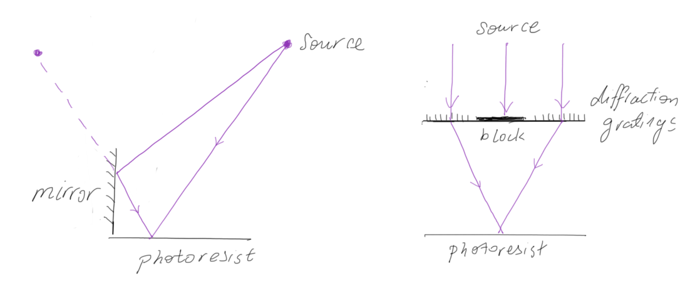

# Concept

Interference lithography (IL) relies on the recording in photoresist of the interference pattern produced from the intersection of two light beams. The first such systems used a mirror (in Lloyd's configuration) and a coherent laser source. Here the concept is extended in 2016 to it's technological limits: by using a spatially and temporally coherent x-ray light beam produced from a synchrotron source combined with a transmission diffraction grating to produce the interference pattern.

The wavelength chosen is **13.5 nm**, called extreme UV (EUV), a highly relevant wavelength used in industry for state-of-the-art microelectronics manufacturing due to the availability of sources, mirror materials, and suitable photoresists. A grating arrangement is used to maximize field of view and interference contrast as well as allowing temporal coherence requirements to be relaxed, since different wavelengths lead to the same aerial image.

Note that it is also possible to produce interference patterns from incoherent sources such as Talbot lithography or using holographic masks.

*Fig. 1: EUV-IL using a Lloyd's mirror (left); EUV-IL using a transmission diffraction grating with central beam stop (right).*

For the scheme on the right, the Bragg equation gives:

$$
\begin{align*}
  & p = \frac{\lambda}{2\sin\theta} = \frac{q}{2m}
\end{align*}
$$

where $$p$$ is the periodicity of the image, $$q$$ is the periodicity of the grating, $$\lambda$$ is the wavelength, $$\theta$$ is the diffraction angle, and $$m$$ is the diffraction order (0, 1, 2, ...). From this equation you can see that:

1. The image is at the diffraction limit.
2. The image is independent of wavelength. As the wavelength changes so does the diffraction angle, but the $$k$$ vector parallel to the plane remains the same. Therefore the periodicity of the image is fixed by the grating periodicity.
3. The resolution limit occurs at $$\theta = 90\unicode{xB0}$$ (for the first diffraction order $$m = 1$$) which corresponds to 7.75 nm  for EUV wavelength (i.e. 3.875 nm half-pitch).

Next, experimental methods are presented to push the above equation to its technical limit.

# Beamline optics

Synchrotron light is a source of electromagnetic radiation produced from a electron storage ring. Together with free electron lasers, they can produce very high brilliance x-ray radiation tunable from meV to MeV as well as high polarisation, high **collimation**, low emittance, and most importantly for us, high **coherence**.

The XIL-II beamline at the Swiss Light Source (3rd generation, 2.4 GeV synchrotron source) is composed of a linear undulator with 22 permanent magnet pairs with adjustable gap allowing energies of between 70 eV (~17.7 nm) to 500 eV (~2.48 nm). Three mirrors filter out higher harmonics while steering the beam into a 70 μm pinhole, which acts as an extended source. This source then travels 12 m via a shutter to impinge on the transmission mask with a spot size of ~1.2 x 1.8 mm2. The imaging wafer with photoresist is typically placed ~150 μm further on.

# Transmission mask

# Photoresist chemistry
