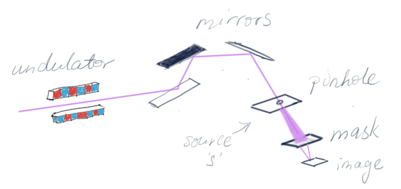
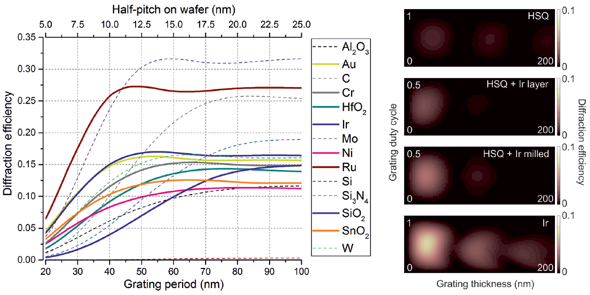
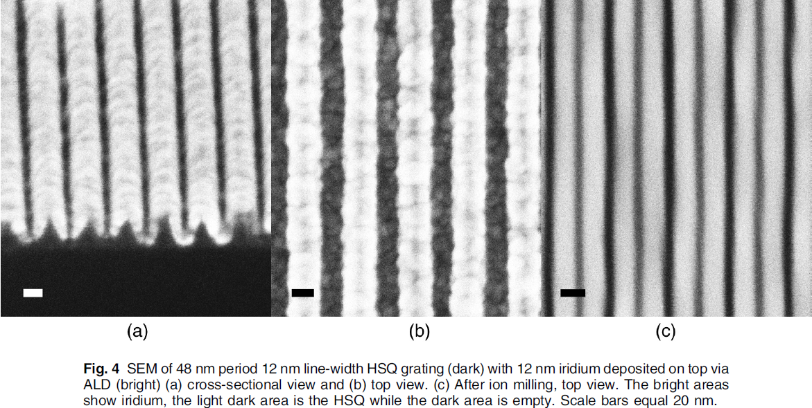
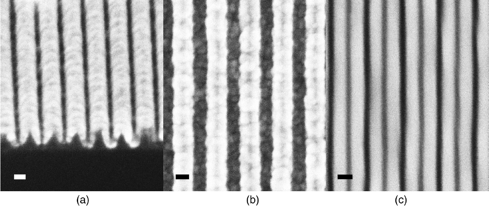

# Concept

Interference lithography (IL) relies on the recording in photoresist of the interference pattern produced from the intersection of two light beams. The first such systems used a mirror (in Lloyd's configuration) and a coherent laser source. Here the concept is extended in 2016 to it's technological limits: by using a spatially and temporally coherent x-ray light beam produced from a synchrotron source combined with a transmission diffraction grating to produce the interference pattern.

The wavelength chosen is **13.5 nm**, called extreme UV (EUV), a highly relevant wavelength used in industry for state-of-the-art microelectronics manufacturing due to the availability of sources, mirror materials, and suitable photoresists. A grating arrangement is used to maximize field of view and interference contrast as well as allowing temporal coherence requirements to be relaxed, since different wavelengths lead to the same aerial image.

Note that it is also possible to produce interference patterns from incoherent sources such as Talbot lithography or using holographic masks.

*Fig. 1: EUV-IL using a Lloyd's mirror (left); EUV-IL using a transmission diffraction grating with central beam stop (right).*

For the scheme on the right, the Bragg equation gives:

$$
\begin{align*}
  & p = \frac{\lambda}{2\sin\theta} = \frac{q}{2m}
\end{align*}
$$

where $$p$$ is the periodicity of the image, $$q$$ is the periodicity of the grating, $$\lambda$$ is the wavelength, $$\theta$$ is the diffraction angle, and $$m$$ is the diffraction order (0, 1, 2, ...). From this equation you can see that:

1. The image is at the diffraction limit.
2. The image is independent of wavelength. As the wavelength changes so does the diffraction angle, but the $$k$$ vector parallel to the plane remains the same. Therefore the periodicity of the image is fixed by the grating periodicity.
3. The resolution limit occurs at $$\theta = 90\unicode{xB0}$$ (for the first diffraction order $$m = 1$$) which corresponds to 6.75 nm  for EUV wavelength (i.e. 3.325 nm half-pitch).

Also, note that the distance between grating centers, $$d$$, is related to the gap between mask and sample, $$g$$, by the diffraction angle $$\theta$$:

$$
\begin{align*}
  & g = \frac{d}{2\tan\theta}
\end{align*}
$$

Thus the gratings need to be close enough together so that the beam spot falls on them, be far enough apart such that interference area is not overlapping with the zero-order transmitted light from the grating areas, and large enough in area for interference to actually happen. EUV-IL is optics-free and has infinite depth-of-focus, hence the gap can be adjusted until the interfering area is maximised, without any effect on contrast.

Next, experimental methods are presented to push the above equation to its technical limit.

# Beamline optics

Synchrotron light is a source of electromagnetic radiation produced from a electron storage ring. Together with free electron lasers, they can produce very high brilliance x-ray radiation tunable from meV to MeV as well as high polarisation, high **collimation**, low emittance, and most importantly for us, high **coherence**.

{:refdef: style="text-align: center;"}
*Fig. 2: XIL-II beamline, SLS, has a tunable undulator, filtering mirrors, and a pinhole as source. A shutter is located between pinhole and mask (not shown)*
{:refdef}

The XIL-II beamline at the Swiss Light Source (3rd generation, 2.4 GeV synchrotron source) is composed of a linear undulator with 22 permanent magnet pairs with adjustable gap allowing energies of between 70 eV (~17.7 nm) to 500 eV (~2.48 nm). Three mirrors filter out higher harmonics while steering the beam into a 70 μm pinhole, which acts as a source. This source then travels 12 m via a shutter to impinge on the transmission mask with a spot size of ~1.2 x 1.8 mm2. The imaging wafer with photoresist is typically placed ~150 μm further on. Therefore, the imaging system will have a component due to extension of the source, resulting in blur. For the above parameters, a gap between mask and image of 550 μm will result in a blur in the image of ~3 nm, while gap = 150 μm gives a blur of ~1 nm. The size of the source extension is given by:

$$
\begin{align*}
  & \frac{s_{ext}}{g} = \frac{s}{L}
\end{align*}
$$

where $$s_{ext}$$ is the size of the source extension on the image, $$s$$ is the size of the source (in this case 70 μm), $$g$$ is the mask to image distance, and $$L$$ is the source to mask distance. From this equation it can be seen that to minimise source extension (i.e. the blur), the image should be close to the mask and/or the source far away from the mask and/or the size of the source (i.e. pinhole) should be small. This results in a number of practical tradeoffs:

- A small pinhole means less light intensity resulting in longer exposure times meaning mechanical stability of the setup comes into play.
- If the pinhole to mask distance is too large, a similar loss in light flux occurs as the beam is now spread out over a larger spot area.
- Since the wavelength, target pattern periodicity, and therefore grating periodicity are set, the diffraction angle is set. Therefore, decreasing the mask to image distance means that the field of view becomes smaller and smaller as the central beam stop needs to be made smaller and smaller. Mechanical tolerances also come into play at such distances.

For a target periodicity of 6 nm half-pitch, the presented arrangement results in ~1 nm blur (17%) without taking into account mechanical vibrations.

# Mechanical stability

Assuming the beam is fairly stable (this may not be the case, as the optical components along the beam path might be badly isolated, but in any case beam stability is not crucial as the beam spot is overlapping the whole mask) then the experimentalist must ensure mechanical stability between mask and sample. There are a number of things to take into consideration:

- The mask should be glued onto a holder with a glue that doesn't degas too much and is mechanically stable.
- The mask should contact the sample wafer with pins set at the correct gap distance, and the assembly held in place by springs.
- A settling time is necessary after each stage movement.
- The experiment is best done on a weekend, at night, when no other construction works or people are in the vicinity. Further, winter is the best time as humidity is fairly low.

# Transmission mask

There are two main design choices for fabricating a suitable transmission mask. Let's say we are targeting a half-pitch of 6 nm on the sample wafer. This means we need to fabricate diffraction gratings with half-pitch of 12 nm. We need to choose:

1. Grating material: choice of material affects diffraction efficiency as well as ease of pattern transfer and fabrication.
2. Patterning method: for such high-resolution diffraction gratings, e-beam lithography is the only choice for initial patterning. There are some procedures to optimise its use. Some fabrication tricks can be used to further increase the grating periodicity.

Because the diffraction grating dimensions are similar to the EUV wavelength, rigorous methods need to be used for optical calculations as the scalar diffraction theory breaks down. I used RCWA, a numerical method suitable for periodic structures (in particular I used the [RODIS](https://www.photonics.intec.ugent.be/research/facilities/design/rodis/default.htm) package from University of Gent). A more detailed discussion on EUV diffraction optics can be found elsewhere.

I took the refractive indices from a whole bunch of suitable materials for EUV from the Lawrence Berkeley Center for X-ray Optics [website](https://henke.lbl.gov/optical_constants/). Then I simulated the 1st order diffraction efficiency for different grating duty cycles with grating heights up to 200 nm (anything higher would result in very large aspect ratios of the structures causing their collapse). The maximum diffraction efficiency for various materials and grating periodicities within the range duty cycle 0 to 1 and height 0 to 200 nm is plotted below in figure 3, left. The diffraction efficiencies calculated for various duty cycles and heights for HSQ and conformally deposited Ir, targeting a 6 nm half-pitch image, is shown in figure 3, right, and was the fabrication strategy used as described in the following section.

*Fig. 3: Left, maximum 1st order diffraction efficiency for various materials and grating periodicities within the range duty cycle 0 to 1 and height 0 to 200 nm. Right, 1st order diffraction efficiency of gratings targeting 6 nm half-pitch on sample wafer for various materials. Each of these plots on the right graph was performed for all the materials and periodicities on the left graph and the maximum value plotted.*

The fabrication limitations for certain grating periodicities together with possible materials and techniques is summarised below:

| Target half-pitch | Grating Periodicity | Material | Technique | Limitations |
|:----------|:------------|:---------|:----------|:------------|
| > 20 nm | > 80 nm | Metals (Au, Cr, Ni, etc.) | LIGA or RIE | Limited by pattern transfer |
| 10 - 20 nm | 40 - 80 nm | HSQ | Direct e-beam written grating | Diffraction efficiency drops below 40 nm |
| 8 nm | 64 nm | Mo | ICP-RIE + 2nd order diffraction | Etching optimisation very difficult |
| 7 nm | 28 nm | HfO2 and SnO2 | Direct e-beam written grating | E-beam electron proximity effect |
| **6 nm** | **48 nm** | **HSQ lines + Ir** | **Grating line doubling by conformal ALD followed by ion milling** | **Best candidate to reach resolution limit of EUV-IL (3.5 nm half-pitch)** |
{: style="font-size: 80%;"}

The fabrication strategy to push the resolution limit is as follows:

- Using HSQ together with e-beam lithography, write 12 nm lines with 48 nm periodicity. This relaxation of the periodicity mitigates to some degree the electron proximity effect in e-beam, where scattered electrons limit the e-beam resolution. HSQ is also the highest resolution e-beam negative tone photoresist available. By choosing a very small e-beam current and aperture (to decrease the spot size), the e-beam can be coaxed into writing well resolved grating lines with line-widths of 12 nm and good profile.
- The 0th order beam block is fabricated by overlaying a second e-beam exposure together with PMMA and using the LIGA process where Cr/Au is evaporated and lifted-off and Ni is electroplated on top.
- Conformal Ir is coated on the 12/48 nm HSQ grating using plasma enhanced ALD. Plasma enhanced improves surface quality of the deposited material by lowering grain size and deposition rate. The target is 12 nm of Ir deposition.
- The final Ir coating is ion milled using Ar which is highly directional, removing the top and bottom Ir but leaving the Ir on the sidewalls of the HSQ, resulting in a line doubled grating of ideally 12 nm of Ir (1st sidewall), 12 nm of HSQ (line), 12 nm of Ir (2nd sidewall), 12 nm of air (space).

The result is shown in figure 4 above. Further removal of the HSQ via HF dip was considered risky in causing pattern collapse and so was avoided, however a F based plasma etch might be one way to remove the HSQ and further improve the diffraction efficiency. Ion milling (Fig. 4c) has the added benefit of smoothing the rough Ir nanocrystals.

Although I have briefly outlined the fabrication procedure above, the actual work requires much care in every step, from ensuring absolutely clean beakers, to making sure the droplet of water supporting the SiN membrane during spin-coating is not contaminated, to making sure the SiN membranes themselves where patterned exactly along the wafer crystal planes as any error would result in warped membranes due to stress caused by rough membrane edges. A short list of clean-room / nanofabrication tips and tricks can be found here.

# Photoresist chemistry

At the limits of operation, there is a tradeoff in photoresists between line-edge roughness, resolution, and sensitivity. For EUV, chemically amplified resists show very good sensitivity for example, but is limited in resolution. For HSQ, this is the opposite: it has low sensitivity making it unsuitable for production due to low throughput, but it has the best resolution and LER.

For pushing the resolution limits, the application of photoresist must be taken into account:

- The spin-coated photoresist thickness must be small enough to prevent pattern collapse during development. For example I coated ~20 nm of HSQ, and for 6 nm patterns this is an aspect ratio of ~3. A good aspect ratio where pattern collapse due to capillary forces during development and drying is ~1, so the spin-coat thickness can be further improved and lowered by dilution of the HSQ.
- The problem with dilution is coverage of HSQ over the wafer become inhomogeneous. The substrate must be cleaned and adhesion of HSQ promoted in some way. Starting with a clean single-side polished <100> Si wafer, which is already quite flat, some techniques to promote adhesion include:
  + Deposition of adhesion promoter such as HMDS (spin-coated or vapour deposited). The downside is again, possible inhomogeneous coverage.
  + Light power oxygen plasma. This will clean the surface and activate the SiO2 surface bonds for better chemical adhesion. However, incorrect plasma can start etching the surface causing roughness.
  + Ozone treatment. Similar to plasma treatment with similar downsides.
  + Bake on hotplate at 250 degC for 5 min. This dehydrates the surface and burns off impurities while also activating the surface to some degree.
  + **Dip in developer for 60 s** (in this case NaOH based solution) and rinse with DI water followed by baking on hotplate at 180 degC for 5 min. This pretreatment activates the surface of the wafer as well, promoting photoresist adhesion. This was the method chosen, giving the best results overall in terms of HSQ thickness and film homogeneity.

# Results and Conclusions

Putting it all together, a dose of 7500 mJ/cm2 gave the best result (Fig. 5). SEM analysis calculated a pitch of 12.245 nm, critical dimension of 5.7 nm, and duty cycle of 0.458. Given that we used the best performing resist (HSQ) and best EUV-IL tool (XIL-II, PSI), there is no clear way to isolate the problems shown in the structures of figure 5. It could be due to errors in mask fabrication (e.g. LER of mask lines), photoresist pattern collapse (e.g. resolution limit of HSQ, secondary electron effect), and/or tool tolerances (e.g. mechanical vibrations).

{: style="display: block; margin-left: auto; margin-right: auto; width: 80%;"}*Fig. 5: 6 nm half-pitch HSQ patterns on silicon substrate fabricated by EUV-IL. Large scale bar = 100 nm, inset scale bar = 20 nm.*

6 nm corresponds to ~12 silicon atoms or ~18 SiO2 molecules. Considering secondary electron blur of ~1-3 nm, 6 nm half-pitch may well be the technological resolution limit for EUV lithography. Further decreases in resolution may be accomplished by using a slightly lower wavelength (e.g. EUV+: 12.5 nm), decreasing source extension by using a smaller pinhole, moving the mask further away from the source, improve diffraction mask efficiency by using Ru or removal of HSQ or thinner support membranes (or even Si membranes) to improve transmission efficiency.

# References

[1] Fan, D., & Ekinci, Y. (2016). Photolithography reaches 6 nm half-pitch using extreme ultraviolet light. Journal of Micro/Nanolithography, MEMS, and MOEMS, 15(3), 033505. https://doi.org/10.1117/1.jmm.15.3.033505

[2] https://henke.lbl.gov/optical_constants/

[3] https://www.photonics.intec.ugent.be/research/facilities/design/rodis/default.htm

# [Back](../scitech.html)

